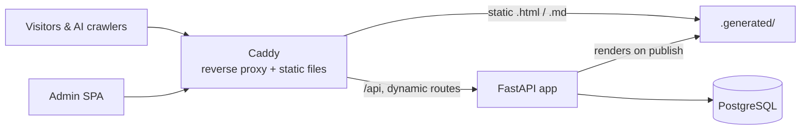
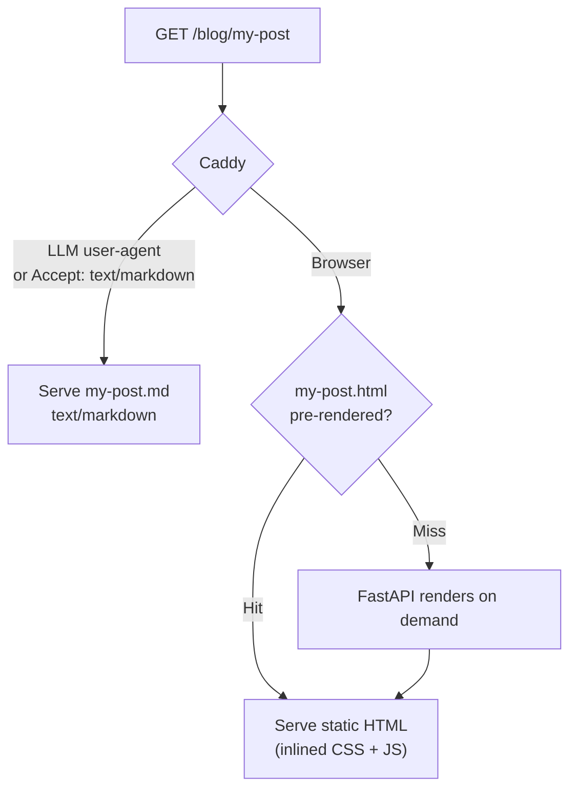

<p align="center"></p>

<h1 align="center">Plym</h1>

<p align="center">
  <strong>Modern CMS for the AI-native web</strong><br>
  Markdown to agents, HTML to humans — served in milliseconds to everyone.
</p>

<p align="center">
  <a href="LICENSE"></a>
  
  <a href="https://github.com/plym-io/plym/actions/workflows/main.yml"></a>
  <a href="https://github.com/astral-sh/ruff"></a>
  
</p>

<p align="center">
  <a href="#quickstart">Quickstart</a> ·
  <a href="#how-it-works">How it works</a> ·
  <a href="#configuration">Configuration</a> ·
  <a href="#the-plym-cli">CLI</a> ·
  <a href="#development">Development</a> ·
  <a href="https://plym.io">Website</a>
</p>

---

Most content systems render one thing: HTML for a browser. Plym renders **two**. Every published post is pre-built into a self-contained static HTML file for human readers *and* a clean Markdown twin for the growing population of AI agents — GPTBot, ClaudeBot, PerplexityBot, Gemini, and dozens of others — that increasingly read the web on your audience's behalf. Humans get a page that paints in a single request; models get exactly the text they want, with no markup to wade through. Both come from the same source, automatically.

It ships as a small Docker stack you can stand up with one command, comes with a built-in CLI that will even provision your reverse proxy and TLS, and is built to a strict, modern Python standard throughout.

## Highlights

- **Built for AI crawlers.** Content negotiation serves Markdown to LLM user-agents and any `Accept: text/markdown` client, HTML to everyone else — from the same URL.
- **Static-file fast.** Posts are pre-rendered to standalone HTML with **inlined CSS and syntax-highlighting JS**, served straight off disk by Caddy with `stale-while-revalidate`, falling back to the app only on a miss.
- **SEO complete by default.** Auto-generated `sitemap.xml` and `robots.txt`, canonical URLs (with per-post overrides), Open Graph + article metadata, and self-hosted fonts.
- **Markdown-native authoring.** Tables, footnotes, task lists, fenced/super-fenced code, auto table-of-contents, reading-time, tags, and lazy-loaded images.
- **One-command install.** A single `curl … | sh` brings up Postgres, the API, and Caddy, seeds an admin user, and publishes your first post.
- **A real CLI.** Run many blogs on one box, point a blog at your domain through **nginx, Caddy, or Traefik** (TLS included), install themes, and update the whole stack — all from `plym`.
- **Sensible auth.** JWT access/refresh tokens, Argon2 password hashing, and `reader` / `editor` / `administrator` roles.
- **Operable.** Automatic migrations and scheduled backups on boot, OpenTelemetry tracing (console or OTLP), and a `/health` endpoint.

## Quickstart

**Prerequisites:** [Docker](https://docs.docker.com/get-docker/) with Compose v2, plus `git`, `curl`, and `openssl` on your `PATH`.

```bash
curl -fsSL https://plym.io/install | sh
```

The installer prompts for a blog name and admin email (or pass them inline):

```bash
curl -fsSL https://plym.io/install | sh -s "My Blog" "you@example.com"
```

It clones the repo, generates secrets, brings the stack up, waits for health, and publishes a welcome post. When it finishes you'll see something like:

```
  plym is live.

  Blog       http://localhost:9173
  Admin      http://localhost:9173/blog/plym-admin
  API docs   http://localhost:9173/docs
```

Generated admin credentials are written to `.plym-credentials` in the install directory. The default port is **9173**; if it's taken, the installer picks the next free one.

> Ready for a real domain? Jump to [Going to production](#going-to-production).

## How it works

Plym is three small services orchestrated by Docker Compose:



- **`caddy`** — the front door. Compresses (zstd/gzip), serves pre-rendered pages and assets directly off disk, and reverse-proxies everything dynamic to the API.
- **`api`** — the FastAPI application: authoring API, rendering pipeline, auth, migrations, backups.
- **`db`** — PostgreSQL 16.

### The two-audience request flow

When a post is published (or re-rendered), the pipeline writes **two** files into `.generated/`: a `{slug}.html` with all CSS and Prism JS inlined, and a `{slug}.md` containing the source Markdown. Caddy then routes each request to the right one:



The crawler list and the `Accept`-header rule live in [`docker/ai-crawlers.caddy`](docker/ai-crawlers.caddy) and are easy to extend. Every response sets `Vary: User-Agent, Accept` so caches stay honest.

### On startup

Each boot the API: applies pending SQL migrations, ensures the superuser exists, reconciles `.generated/` against the database (removing orphaned files), then builds runtime assets — self-hosted webfonts, Prism for your configured languages, localized logo/favicon, and a minified CSS bundle. A backup scheduler starts in the background. Asset steps fail soft: a missing font or Prism download logs a warning and serving continues.

## Configuration

Plym separates **infrastructure** (secrets, ports, database) from **site presentation**.

### `.env` — infrastructure

Read at process start (prefix `PLYM_`). Copy `.env.example` and adjust. Common keys:

| Variable | Default | Description |
| --- | --- | --- |
| `PLYM_PORT` | `9173` | Host port Caddy listens on. |
| `PLYM_BLOG_PREFIX` | `/blog` | Path the blog is mounted under. |
| `PLYM_DB_*` | `plym` | PostgreSQL host, port, name, user, password. |
| `PLYM_SUPERUSER_EMAIL` / `_PASSWORD` | — | Bootstrapped admin account. |
| `PLYM_JWT_SECRET` | — | Signing secret (min 16 chars; the installer generates one). |
| `PLYM_JWT_ACCESS_TTL_SECONDS` | `900` | Access-token lifetime. |
| `PLYM_JWT_REFRESH_TTL_SECONDS` | `2592000` | Refresh-token lifetime. |
| `PLYM_UPLOAD_MAX_BYTES` | `10485760` | Max media upload size. |
| `PLYM_DEBUG` | `false` | When `true`, enables `/docs`, `/redoc`, and the OpenAPI schema. |

### `config.yaml` — site & content

Read at runtime, so most changes apply with a reload — no rebuild. Copy `config.yaml.example`. Notable sections:

| Section | What it controls |
| --- | --- |
| `name`, `website`, `blog_prefix`, `language` | Identity and where the blog lives. |
| `template` | Active theme (see [Templates](#templates)). |
| `fonts`, `colors` | Override the template's typography and palette. |
| `prism` | Syntax highlighting: enable, language list, theme. |
| `http_cache` | `Cache-Control` behavior for pages and the index. |
| `robots` | Whether to serve `robots.txt` and which paths to disallow. |
| `pagination`, `reading` | Index page size and words-per-minute for reading time. |
| `inject.head` / `inject.body` | Operator-controlled HTML injected before `</head>` / `</body>` — analytics, verification tags, custom `<link>`s. |
| `backup.frequency` | Backup interval in days. |
| `media.location` | Optional external/CDN base for uploaded media. |

After editing `config.yaml`:

```bash
plym reload    # runtime-only changes (caching, pagination, robots, media)
plym rebuild   # changes that affect rendered HTML (template, prism, reading, logo) — re-renders every post
```

## The `plym` CLI

The installer drops a `plym` command on your machine. It auto-detects which blog you mean — the one you're inside, otherwise the active blog (`plym use`), otherwise the only one present.

| Command | Description |
| --- | --- |
| `plym list` | Show every blog on this machine (active one highlighted). |
| `plym use <name>` | Set the active blog for commands run outside a blog directory. |
| `plym set url <url> --nginx\|--caddy\|--traefik` | Serve a blog on your domain. Accepts `example.com`, `blog.example.com`, or `example.com/blog`. |
| `plym unset url` | Remove the reverse-proxy config Plym created. |
| `plym template install <name> [ref]` | Install a theme from the registry (`--update` to force a fresh fetch). |
| `plym admin update` | Refetch the admin bundle and restart the API. |
| `plym update` | Pull the latest Plym, rebuild, refetch admin, reload Caddy, and re-render. |
| `plym reload` | Restart the API to apply `config.yaml` (no re-render). |
| `plym rebuild` | Restart the API and re-render every published post. |
| `plym reinstall [--yes]` | Wipe the stack **and its database volume**, then reinstall from source. Destructive. |

Pass `-v`/`--verbose` before any command to stream the underlying Docker, container, and proxy logs. Run `plym -h` for the full reference.

## Going to production

Point a blog at your own domain in one step. Plym writes the proxy config, and for nginx/Caddy it will install the proxy if it's missing and obtain a TLS certificate for you:

```bash
# Serve on a subdomain via Caddy (automatic HTTPS)
sudo plym set url blog.example.com --caddy

# Serve under a path via nginx (certbot handles the certificate)
sudo plym set url example.com/blog --nginx
```

`--traefik` writes a `docker-compose.traefik.yml` with router labels for you to wire into an existing Traefik. Prefer to configure the proxy yourself, or front everything with a CDN? Forward your `{blog_prefix}` routes to the app's port — see the [reverse-proxy guide](https://plym.io/docs/reverse-proxy).

## Templates

Themes live in a separate registry, [`plym-io/plym-templates`](https://github.com/plym-io/plym-templates):

```bash
plym template install <name>
```

A template declares its own fonts, colors, and Prism theme in `template.yaml`; anything you set in `config.yaml` overrides those choices. To build your own, see the [template development guide](https://plym.io/blog/creating-templates-for-plym).

## Development

Run the stack from a clone for local hacking:

```bash
git clone https://github.com/plym-io/plym.git
cd plym
cp .env.example .env
cp config.yaml.example config.yaml
docker compose up --build
```

To work on the Python package directly (Python 3.12+):

```bash
python -m venv .venv && source .venv/bin/activate
pip install -e ".[dev]"

ruff check .          # lint
mypy plym             # strict type-check
pytest                # test suite
```

Tests use `pytest` + `pytest-asyncio` against a PostgreSQL instance. CI runs the same checks plus a full end-to-end suite that stands up the real Compose stack — see [`.github/workflows`](.github/workflows). Pull requests are validated by **PR Checks**; merges to `main` run the **Integration** workflow.

### Project layout

```
plym/
├── api/            # FastAPI routers: auth, posts, media, tags, users, config, SEO
├── service/        # Business logic: auth, posts, media, backups, bootstrap
├── repository/     # Async data access (SQLAlchemy 2.0 core)
├── render/         # Markdown → HTML, templating, asset inlining, caching
├── build/          # Startup asset pipeline: fonts, Prism, CSS bundling
├── models/         # Pydantic models
├── db/migrations/  # Ordered SQL migrations
├── templates/      # Bundled default theme
└── instrumentation/# OpenTelemetry tracing & middleware
docker/             # Dockerfile, Caddyfile, AI-crawler rules
bin/                # The plym CLI
```

### Engineering standards

The codebase holds a deliberately tight bar: full type hints with **mypy `strict`**, lint and import rules via **Ruff**, typed exceptions over silent failures, small focused functions, and atomic writes for generated files. Please match the surrounding style.

## REST API

Interactive docs are available at `/docs` when `PLYM_DEBUG=true`. The surface in brief:

| Area | Endpoints |
| --- | --- |
| **Auth** | `POST /api/auth/login`, `/refresh`, `/logout`, `/change-password` |
| **Posts** | `GET /api/posts`, `GET /api/posts/{id}`, `POST /api/posts`, `PATCH /api/posts/{id}`, `POST /api/posts/{id}/refresh`, `DELETE /api/posts/{id}`, `POST /api/posts/preview` |
| **Media** | `POST /api/media`, `GET /api/media`, `GET /api/media/{id}`, `DELETE /api/media/{id}` |
| **Tags** | `GET /api/tags` |
| **Users** | `GET /api/users`, `GET/PATCH /api/users/me`, `POST /api/users`, role + deactivation endpoints |
| **Config** | `GET /api/config` |
| **SEO** | `GET /sitemap.xml`, `GET /robots.txt` |

Write operations on posts and media require the `editor` role; user management requires `administrator`. Posts move through `draft → published → archived`; only published posts are pre-rendered and listed in the sitemap.

## Tech stack

**Backend** — [FastAPI](https://fastapi.tiangolo.com/), [Uvicorn](https://www.uvicorn.org/), [SQLAlchemy 2.0](https://www.sqlalchemy.org/) (async, `asyncpg`), [Pydantic v2](https://docs.pydantic.dev/). **Rendering** — [Python-Markdown](https://python-markdown.github.io/) with [PyMdown Extensions](https://facelessuser.github.io/pymdown-extensions/), [Jinja2](https://jinja.palletsprojects.com/), [Pillow](https://python-pillow.org/), [Prism](https://prismjs.com/). **Auth** — [Argon2](https://github.com/hynek/argon2-cffi), [PyJWT](https://pyjwt.readthedocs.io/). **Infra** — [PostgreSQL](https://www.postgresql.org/), [Caddy](https://caddyserver.com/), [Docker](https://www.docker.com/), [OpenTelemetry](https://opentelemetry.io/).

## Contributing

Contributions are welcome. Open an issue to discuss substantial changes first, keep PRs focused, and make sure `ruff`, `mypy`, and `pytest` all pass locally before opening one. By contributing you agree your work is licensed under the project's MIT license.

## License

Released under the [MIT License](LICENSE). © 2026 Plym contributors.
